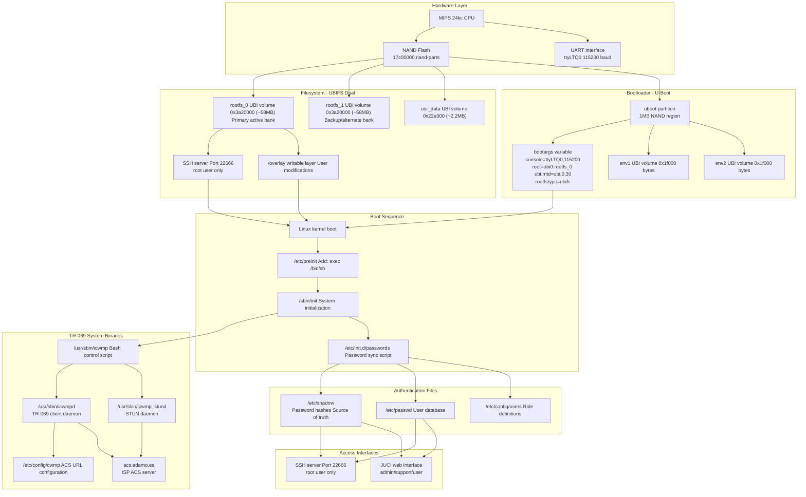

## Home

## Purpose and Scope

This wiki documents the **Genexis Pure ED500** router modification project, which enables users to gain complete **root access** to their ISP-locked device and **remove remote management backdoors**. The device, distributed by Adamo and other ISPs, runs a modified **OpenWrt** firmware with **Iopsys** customizations and the **JUCI** web interface.

This documentation covers:

* **Root access procedures** via UART and bootloader manipulation (see **Gaining Root Access**)
* **ISP backdoor removal** including TR-069/CWMP remote management systems (see **Removing ISP Backdoors**)
* **Password management** understanding and credential modification (see **Password and User Management**)
* **Recovery procedures** for bricked or misconfigured devices (see **Recovery Procedures**)
* **Firmware management** including version information and flashing procedures (see **Firmware Management**)

For hardware specifications and boot process details, see **Device Overview**.

---

## Project Overview

The Genexis Pure ED500 is a **MIPS 24kc-based OpenWrt router** that has been locked down by ISPs for remote management. This project provides a comprehensive methodology for:

* **Bypassing authentication** through hardware-level **UART access** and **U-Boot** bootloader manipulation
* **Gaining persistent root access** by modifying `/etc/preinit` to provide a fully-initialized root shell
* **Understanding the password synchronization system** between UCI configuration files and system authentication
* **Removing TR-069 backdoors** permanently from both UBIFS firmware banks
* **Recovering from firmware failures** using documented TFTP and UART-based recovery procedures

The approach documented here achieves complete user control without requiring firmware recompilation or custom firmware installation. All modifications work within the existing **OpenWrt/Iopsys** environment.

---

## System Architecture Overview

The following diagram illustrates the major system components and their relationships within the Genexis Pure ED500 device:

**System Architecture: Major Components and File Paths**

The system operates in distinct layers from **hardware** through to **user interfaces**, with ISP control mechanisms integrated throughout the boot and service layers.

---

## Critical System Components

The following diagram maps physical hardware components to specific files, binaries, and configuration entries in the codebase:



| Component | File Path | Purpose | Modified in Project |
| :--- | :--- | :--- | :--- |
| **Boot Configuration** | `bootargs` (U-Boot variable) | Kernel boot parameters, controls init process | **Yes** - for initial access |
| **Early Init Hook** | `/etc/preinit` | First userspace script, executes before full init | **Yes** - adds `exec /bin/sh` |
| **System Init** | `/sbin/init` | Primary init process, starts all services | No |
| **Password Sync** | `/etc/init.d/passwords` | Syncs UCI passwords to `/etc/shadow`, self-cleaning | No |
| **User Definitions** | `/etc/config/users` | UCI configuration for user accounts | No |
| **Password Config** | `/etc/config/passwords` | UCI configuration for password hashes | No |
| **System Auth** | `/etc/shadow` | System password hashes (root, admin, support, user) | **Yes** - via `passwd` command |
| **User Accounts** | `/etc/passwd` | System user account database | **Yes** - via `passwd` command |
| **TR-069 Control** | `/usr/sbin/icwmp` | Bash script controlling TR-069 client | **Yes** - renamed/deleted |
| **TR-069 Client** | `/usr/sbin/icwmpd` | Main TR-069/CWMP client daemon binary | **Yes** - renamed/deleted |
| **STUN Daemon** | `/usr/sbin/icwmp_stund` | STUN daemon for NAT traversal to ACS server | **Yes** - renamed/deleted |
| **TR-069 Config** | `/etc/config/cwmp` | UCI configuration for TR-069 system | **Modified** by removal |
| **Primary Firmware** | `rootfs_0` (UBI volume) | Active firmware bank (UBIFS) | **Modified** for persistence |
| **Secondary Firmware** | `rootfs_1` (UBI volume) | Alternate firmware bank (UBIFS) | **Modified** for persistence |
| **Removal Script** | `scripts/cleanscript_persistant.sh` | Permanently removes backdoors from both banks | Provided in repo |

---

## Access Control Flow

This diagram shows how user access progresses from initial ISP-locked state to full user control, mapping each stage to specific code entities:


**Access Control Flow: From ISP Lock to User Control**

This flow demonstrates the complete process of gaining control over the device, with each node referencing specific files, commands, or system components that must be modified or executed.

---

## Key System Files Reference

### Authentication and User Management

The password synchronization system operates through a chain of files:

* `/etc/config/users` - Defines user accounts (**root, admin, support, user**) with UCI format
* `/etc/config/passwords` - Contains password hashes in UCI format, processed at boot
* `/etc/init.d/passwords` - Init script that reads UCI passwords, applies them via `passwd` command, then **deletes UCI entries** to prevent overwriting
* `/etc/passwd` - Standard Linux user account database
* `/etc/shadow` - Standard Linux password hash storage

The critical behavior: `/etc/init.d/passwords` executes during boot, syncs UCI passwords to `/etc/shadow`, then runs `uci delete passwords.admin.password` to prevent persistent overwriting. This means **password changes made via `passwd` command persist across reboots.**

### ISP Backdoor Components

The **TR-069** remote management system consists of:

* `/usr/sbin/icwmp` - Bash script that launches and controls the TR-069 client (see **TR-069 Components**)
* `/usr/sbin/icwmpd` - Main TR-069/CWMP client daemon binary that communicates with ACS server
* `/usr/sbin/icwmp_stund` - STUN daemon enabling NAT traversal for ISP to reach device
* `/etc/config/cwmp` - UCI configuration file for TR-069 parameters
* `/usr/share/icwmp/functions/*` - CWMP operation handlers

These components connect to `acs.adamo.es`, the ISP's **Auto Configuration Server (ACS)**, enabling remote firmware updates, configuration changes, and system access.

### Boot and Initialization

The boot sequence involves:

* **U-Boot** loads from `/boot/uboot.img` on NAND flash (1MB partition)
* `bootargs` U-Boot environment variable specifies: `console=ttyLTQ0,115200 root=ubi0:rootfs_0 ubi.mtd=ubi,0,30 rootfstype=ubifs`
* **Kernel** boots from `rootfs_0` or `rootfs_1` UBI volume
* `/etc/preinit` executes as first userspace script
* `/sbin/init` starts the full init system and all services

Modifying `/etc/preinit` to add `exec /bin/sh` at the end provides a **persistent root shell** after all services initialize but before control returns to normal operation.

---

## Getting Started

To gain control of your Genexis Pure ED500:

1.  **Connect UART hardware** - Required for initial access (see **UART Connection Setup**)
2.  **Interrupt U-Boot and boot to minimal shell** - Modify `bootargs` to `init=/bin/sh` (see **U-Boot Bootargs Modification**)
3.  **Make filesystem writable and modify /etc/preinit** - Add `exec /bin/sh` for persistent access (see **Persistent Root Shell via Preinit**)
4.  **Change passwords** - Use `passwd` command for **root, admin, and support** users (see **Changing Passwords**)
5.  **Remove TR-069 backdoor** - Rename binaries and run `cleanscript_persistant.sh` (see **Removing ISP Backdoors**)
6.  *Optional:* **Recover from issues** - Use documented TFTP procedures if needed (see **Recovery Procedures**)

For complete firmware version information and ISP-specific customizations, see **Firmware Management**.

For advanced usage including package installation and custom services, see **Advanced Topics**.

---

## Important Notes

### SSH Access Configuration

The device runs an SSH server on **port 22666** (not the standard port 22). Only the **root** user can access SSH because other users (admin, support, user) do not have home directories configured, which prevents SSH authentication even with correct passwords.

### Dual-Bank Persistence

The device uses a **dual-bank UBIFS system** with `rootfs_0` and `rootfs_1` volumes. Changes must be applied to **both banks** to survive factory resets or firmware switches. The `cleanscript_persistant.sh` script handles this automatically for backdoor removal.

### WAN Connection Warning

When connected to WAN with **TR-069** still active, the ISP's ACS server can automatically reflash the firmware, undoing modifications. Always **disable or remove TR-069 components** before connecting to ISP network after gaining root access.

## Device Overview

## Purpose and Scope

This page provides a comprehensive overview of the **Genexis Pure ED500** router hardware, firmware architecture, and system components. It introduces the device's hardware platform, software environment, and key subsystems that are explored in detail throughout this wiki.

For specific details about hardware specifications, see **Hardware Architecture**. For information about the OpenWrt/Iopsys software stack and JUCI interface, see **Software Stack**. For the complete boot sequence, see **Boot Process**.

---

## Device Identity

The **Genexis Pure ED500** is a residential gateway router distributed by **Adamo ISP in Spain**. The device runs a modified version of **OpenWrt** customized by **Iopsys**, featuring the **JUCI** web management interface. The router is notable for its ISP-locked configuration and **TR-069 remote management** capabilities that provide the ISP with extensive control over the device.

### Device Specifications

| Property | Value |
| :--- | :--- |
| **Manufacturer** | Genexis |
| **Model** | Pure ED500 |
| **Processor** | MIPS 24kc architecture |
| **RAM** | 224 MB (usable) |
| **Flash Storage** | NAND Flash with UBI |
| **Base OS** | OpenWrt (Iopsys modified) |
| **Web Interface** | JUCI |
| **SSH Port** | 22666 |
| **ISP Distributor** | Adamo (Spain) |

---

## System Architecture Overview

The following diagram illustrates the complete system architecture, mapping natural language concepts to actual code entities, file paths, and binaries in the system.


**System Architecture: Major Components and File Paths**

The system components are organized in layers, from the **Hardware Layer** up to the **User Interfaces**, showing how OpenWrt, Iopsys, and the ISP's control mechanisms are integrated.

---

## Hardware Platform

The device is built on a **MIPS 24kc** processor architecture with **224 MB** of usable RAM. Storage is provided by **NAND flash memory** organized using the **MTD** (Memory Technology Device) subsystem with **UBI** (Unsorted Block Images) for wear leveling and bad block management.

### Storage Architecture

The NAND flash is partitioned into two MTD partitions defined in `mtdparts`:

| Partition | MTD Device | Size | Purpose |
| :--- | :--- | :--- | :--- |
| **uboot** | `/dev/mtd0` | 1 MB | U-Boot bootloader |
| **ubi** | `/dev/mtd1` | Remaining | UBI volumes container |

Within the UBI partition, several volumes are created:

* `ubi0:env1` and `ubi0:env2` - Dual **U-Boot environment** storage
* `ubi0:rootfs_0` - **Primary firmware bank** (UBIFS)
* `ubi0:rootfs_1` - **Secondary firmware bank** (UBIFS)
* `ubi0:usr_data` - User data persistence

This **dual-bank system** allows firmware updates with fallback capability and complicates attempts to permanently modify the system, as both banks must be modified for changes to persist across factory resets.

**Physical Interfaces:**

* **UART serial console** on `ttyLTQ0` at **115200 baud**
* Ethernet ports (WAN + LAN)
* Wi-Fi radios (2.4 GHz and 5 GHz)
* USB ports

For detailed hardware specifications and physical access information, see **Hardware Architecture**.

---

## Software Environment

### System Component Hierarchy


**Software Component Hierarchy**

### OpenWrt Base

The device runs **OpenWrt**, an embedded Linux distribution designed for routers. OpenWrt provides:

* Package management via `opkg`
* **Unified Configuration Interface (UCI)**
* Network configuration abstraction
* Service management via `/etc/init.d/` scripts

### Iopsys Modifications

**Iopsys** is a commercial OpenWrt variant that adds:

* Enhanced **TR-069** support for ISP management
* Custom user management system
* **JUCI** web interface framework
* ISP-specific customization hooks

### JUCI Web Interface

**JUCI** (pronounced "juicy") is the web-based management interface. It consists of:

* Multiple `juci-*` packages providing UI components
* `rpcd` daemon for backend RPC calls
* `uhttpd` web server
* Integration with **UCI** for configuration persistence

JUCI authenticates users against the standard Linux `/etc/passwd` and `/etc/shadow` files, meaning changes to system passwords immediately affect web interface access.

For detailed information about the software stack components, see **Software Stack**.

---

## Configuration Management

### UCI System

The **Unified Configuration Interface (UCI)** is OpenWrt's central configuration system. Configuration files are stored in `/etc/config/` as plain-text files with a specific syntax.

**Key UCI configuration files:**

| File | Purpose |
| :--- | :--- |
| `/etc/config/users` | User account definitions (user, support, admin) |
| `/etc/config/passwords` | Temporary password storage for synchronization |
| `/etc/config/cwmp` | TR-069/CWMP client configuration |
| `/etc/config/network` | Network interface configuration |
| `/etc/config/wireless` | Wi-Fi configuration |
| `/etc/config/firewall` | Firewall rules |
| `/etc/config/dhcp` | DHCP/DNS configuration |

### Password Synchronization Mechanism

The device implements a sophisticated password synchronization system:

1.  User accounts are defined in `/etc/config/users`
2.  Password hashes are temporarily stored in `/etc/config/passwords`
3.  At boot, `/etc/init.d/passwords` reads the UCI configuration
4.  The script applies passwords to `/etc/shadow` using the `passwd` command
5.  The script then **deletes the password entries from UCI** using `uci delete passwords.*.password`

This mechanism means that changing passwords via **`passwd` persists** only if the UCI configuration doesn't contain a conflicting entry, as the UCI entries are **self-cleaning** after application.

---

## User Accounts and Authentication

### System Users

The device defines four system user accounts:

| Username | UID | Purpose | Home Directory | Shell |
| :--- | :--- | :--- | :--- | :--- |
| **root** | 0 | Full system administration | `/root` | `/bin/ash` |
| **admin** | Variable | Web interface admin, ISP remote access | Not set | `/bin/false` |
| **support** | Variable | ISP support access | Not set | `/bin/false` |
| **user** | Variable | Limited web interface access | Not set | `/bin/false` |

### Access Control

* **SSH Access:** Only the **`root`** user can SSH into the device. SSH listens on **port 22666** (non-standard). The `admin`, `support`, and `user` accounts cannot SSH because they **lack home directories**.
* **Web Interface (JUCI):** All users can access JUCI, with different permission levels based on their roles.
* **Serial Console (UART):** Physical UART access on `ttyLTQ0` at 115200 baud provides direct console access to any user account.

---

## ISP Remote Management System

### TR-069/CWMP Architecture

The device includes a **TR-069** (Technical Report 069) implementation, also known as **CWMP** (CPE WAN Management Protocol). This is a standardized protocol for remote management of customer premises equipment (CPE) by ISPs.

**TR-069 Components**

The implementation consists of three main binaries in `/usr/sbin/`:

| Binary | Type | Purpose |
| :--- | :--- | :--- |
| **icwmp** | Bash script | Control script that launches and manages the CWMP daemons |
| **icwmpd** | Binary daemon | Main **TR-069/CWMP client** that communicates with the ACS server |
| **icwmp_stund** | Binary daemon | **STUN daemon** for NAT traversal, allows ACS to reach the device |

### ACS Server

The TR-069 clients communicate with **`acs.adamo.es`**, Adamo ISP's **Auto Configuration Server (ACS)**. This server can:

* Remotely modify device configuration
* Change passwords
* Update firmware
* Read device status and statistics
* Execute diagnostic commands

The ACS connection enables the ISP to maintain control over the device even when customers have changed local passwords. This is commonly referred to as a "**backdoor**" because it provides remote access independent of local authentication.

For complete details about TR-069 components and how to remove them, see **ISP Remote Management and TR-069** and **Removing ISP Backdoors**.

---

## Boot and Initialization Flow

### Boot Sequence Overview


The flow starts with the **Hardware** and proceeds through the **U-Boot** bootloader to the **Linux Kernel**. The first userspace script executed is **`/etc/preinit`**, which then launches **`/sbin/init`**. The **Password Sync** script (`/etc/init.d/passwords`) runs during the main service initialization stage to set the passwords and then cleans up the UCI entries.

### Critical Boot Parameters

The **`bootargs`** U-Boot environment variable controls kernel boot parameters:

`console=ttyLTQ0,115200 root=ubi0:rootfs_0 ubi.mtd=ubi,0,30 rootfstype=ubifs mtdparts=17c00000.nand-parts:1m(uboot),-(ubi) init=/sbin/init mem=224M@512M`

Key parameters:

* `console=ttyLTQ0,115200` - Serial console configuration
* `root=ubi0:rootfs_0` - Root filesystem location (primary bank)
* `init=/sbin/init` - Init system path (can be modified to **`/bin/sh`** for root access)

For detailed boot process information, see **Boot Process**.

---

## Access Points and Management Interfaces

### Available Access Methods

| Interface | Port/Location | Authentication | Root Access | Notes |
| :--- | :--- | :--- | :--- | :--- |
| **UART Serial Console** | `ttyLTQ0`, 115200 baud | System accounts | Yes | Requires physical access, U-Boot access |
| **SSH** | TCP port **22666** | `/etc/shadow` | Yes | Only **`root`** user can login |
| **JUCI Web Interface** | HTTP/HTTPS (80/443) | `/etc/shadow` | Via root account | All users can login with different roles |
| **TR-069/CWMP** | `acs.adamo.es` | ISP controlled | Yes | **ISP backdoor**, can override local settings |

### Default Network Configuration

* **LAN IP:** `192.168.1.1` (typical)
* **SSH Port:** `22666` (non-standard)
* **Web Interface:** Port 80 (HTTP) and 443 (HTTPS)
* **UART Console:** Physical connection required

---

## Firmware and Package Management

### Firmware Format

Firmware images use the **`.y3`** file extension and are stored using Git LFS in the repository.

### Package Management

The device uses **`opkg`** (Open Package Management) for software package installation and removal. The package database is stored in `/usr/lib/opkg/status`.

**Important:** When removing TR-069 components, the `opkg status` file **must be updated** to prevent package restoration during system updates.

For firmware details, see **Firmware Management**.

---

## Summary

The Genexis Pure ED500 is a sophisticated ISP-controlled router built on **OpenWrt** with extensive remote management capabilities. Understanding its architecture is essential for gaining full control of the device:

* **Hardware:** MIPS 24kc processor with **dual-bank UBIFS** storage
* **Software:** **OpenWrt + Iopsys + JUCI** stack with **UCI** configuration
* **Boot:** U-Boot → Kernel → **`/etc/preinit`** → `/sbin/init` sequence
* **Authentication:** UCI synchronization to `/etc/shadow` via **`/etc/init.d/passwords`**
* **ISP Control:** TR-069 components (`icwmp`, `icwmpd`, `icwmp_stund`) connecting to `acs.adamo.es`
* **Access:** Multiple interfaces including **UART** (115200 baud), **SSH** (port 22666), and **JUCI** web

The subsequent pages in this wiki detail how to exploit the boot sequence for root access (**Gaining Root Access**), manage authentication (**Password and User Management**), remove ISP control mechanisms (**Removing ISP Backdoors**), and recover from failures (**Recovery Procedures**).

## Hardware Architecture

* Relevant source files

---

## Purpose and Scope

This document describes the physical hardware components and storage architecture of the Genexis Pure ED500 device. It covers the MIPS processor, memory configuration, NAND flash organization, and physical interfaces (particularly UART serial console).

For information about the software running on this hardware, see Software Stack. For details on how the device boots, see Boot Process. For practical UART connection procedures, see UART Connection Setup.

---

## Device Specifications

The Genexis Pure ED500 is a fiber-optic gateway device built on the following hardware platform:

| Component | Specification |
| :--- | :--- |
| Processor | MIPS 24kc architecture |
| System Memory | 224MB @ 512MB offset |
| Flash Storage | NAND flash with UBI layer |
| Board Identifier | norrland |
| Product Name | PURE-ED500 |
| Hardware Version | 1.0 |
| Network Interfaces | Ethernet ports, Wi-Fi |
| Serial Console | UART via ttyLTQ0 at 115200 baud |
| MAC Address Pool | 16 addresses allocated from base MAC |

---

## NAND Flash Architecture

The device's storage is based on NAND flash memory and is organized using two primary layers: MTD (Memory Technology Device) and UBI (Unsorted Block Images).

### MTD Partition Layout

The raw NAND flash is divided into two primary MTD partitions as defined by the boot parameters:

* MTD Partition 0 (uboot): A fixed 1MB partition containing the U-Boot bootloader.
* MTD Partition 1 (ubi): The remaining space (~128MB) that serves as the container for the UBI layer.

MTD Command Line Configuration:
mtdparts=17c00000.nand-parts:1m(uboot),-(ubi)

### UBI Volume Structure

Within the larger MTD ubi partition, the UBI layer manages several logical volumes. This design is key for wear leveling and redundancy.

| Volume Name | Size (Hex) | Size (Approx) | Purpose |
| :--- | :--- | :--- | :--- |
| env1 | 0x1F000 | 127 KB | Primary U-Boot environment variables |
| env2 | 0x1F000 | 127 KB | Backup U-Boot environment variables |
| rootfs_0 | 0x3A20000 | 58 MB | Primary root filesystem (UBIFS) |
| rootfs_1 | 0x3A20000 | 58 MB | Secondary root filesystem (UBIFS) |
| usr_data | 0x22E000 | 2.2 MB | User data and configuration persistence |

The dual-bank design (rootfs_0 and rootfs_1) provides firmware redundancy and is critical for understanding persistent modifications, as changes must often be applied to both banks.


Boot Arguments Specifying Storage:
root=ubi0:rootfs_0 ubi.mtd=ubi,0,30 rootfstype=ubifs

This configuration tells the kernel to mount ubi0:rootfs_0 as the root filesystem using UBIFS.

---

## Memory Architecture

The system memory is configured via the boot parameters:

mem=224M@512M

This indicates:

* Available Memory: 224 MB
* Physical Address Offset: The memory starts at a 512 MB offset in the address space, a common configuration for MIPS-based embedded systems.

---

## UART Serial Interface

The device provides a low-level UART serial console for debugging and recovery.

### Physical Connection

The serial console is accessed through unpopulated header pins on the PCB, often referred to as the "red pins" in documentation.

Serial Port Configuration:

* Device: ttyLTQ0 (Lantiq UART device)
* Baud Rate: 115200
* Settings: 8 Data Bits, No Parity, 1 Stop Bit (8N1), No Flow Control.

### UART Boot Mode

The device supports a special UART boot mode that allows loading a U-Boot image directly into RAM via the serial port. This is used for recovery when the flash is severely corrupted.

The mode is activated by shorting specific circuits on the PCB during power-on.

UART Boot Mode Indicators:
ROM VER: 2.1.0
CFG 02
B
UART

In this mode, the Boot ROM waits for the user to send a U-Boot image file (e.g., u-boot.uart.txt) via UART, executes it from RAM, and provides a functional U-Boot prompt.


---

## Hardware Identification and Configuration

The U-Boot environment variables store key hardware identifiers:

| Variable | Value | Purpose |
| :--- | :--- | :--- |
| board_id | norrland | Board platform identifier, used to select the device tree (norrland.dtb). |
| prodname | PURE-ED500 | Product marketing name. |
| hw_version | 1.0 | Hardware revision. |
| ethaddr | (From device label) | Base MAC address for network interfaces. |
| num_mac_addr | 16 | Number of sequential MAC addresses allocated. |
| verify_boot | 1 | Boot verification is enabled. |

### Hardware-to-Bootloader Interface

The complete hardware initialization flow proceeds as follows:

1. Power On: Hardware initialization begins.
2. Boot ROM: Executes, checks the boot mode (Normal or UART Recovery).
3. U-Boot Load (Normal): Loads U-Boot from the uboot MTD partition.
4. U-Boot Execution: Loads the environment (env1/env2), parses the bootargs, and loads the Linux Kernel from ubi0:rootfs_0.
5. Linux Kernel Start: The kernel mounts the specified root filesystem and begins the system initialization process.

Each parameter in the bootargs configures a hardware or system aspect:
console=ttyLTQ0,115200
root=ubi0:rootfs_0
ubi.mtd=ubi,0,30
rootfstype=ubifs
mtdparts=17c00000.nand-parts:1m(uboot),-(ubi)
init=/etc/preinit
mem=224M@512M

---

## Summary

The Genexis Pure ED500 hardware architecture is defined by its MIPS 24kc core, 224MB RAM, and NAND flash storage. The key features for modification and recovery are:

* Dual-bank UBIFS storage (rootfs_0, rootfs_1) for redundancy.
* Low-level access via the UART serial console (ttyLTQ0, 115200 baud).
* The existence of a UART boot mode for deep recovery from flash corruption.
* Configuration reliance on U-Boot environment variables, including the norrland board ID and critical bootargs.

Understanding this architecture is essential for firmware recovery, persistent modifications, and troubleshooting boot failures.

## Software Stack

* **Relevant source files**

---

## Purpose and Scope

This document describes the software architecture of the **Genexis Pure ED500**, including its **OpenWrt** foundation, **Iopsys** modifications, **JUCI** web interface, **UCI** configuration system, and package management infrastructure.

For details about the boot sequence and initialization process, see **Boot Process**. For information about ISP-installed remote management software, see **ISP Remote Management and TR-069**.

---

## Overview

The Genexis Pure ED500 runs a customized Linux-based firmware stack built on OpenWrt but heavily modified by Iopsys. The software architecture consists of multiple layers, each providing specific functionality for routing, web management, and ISP control.


### OpenWrt Foundation

The Genexis Pure ED500 is built on **OpenWrt**, an open-source Linux distribution designed for embedded network devices.

| Component | Binary Path | Purpose |
| :--- | :--- | :--- |
| **BusyBox** | `/bin/busybox` | Core Unix utilities (symlinked commands) |
| **UBus** | `/bin/ubus` | Message bus for inter-process communication |
| **Procd** | `/sbin/procd` | Process and service management daemon |
| **Netifd** | `/sbin/netifd` | Network interface configuration daemon |
| **OPKG** | `/bin/opkg` | Package manager for installing/removing software |
| **UCI** | `/sbin/uci` | Unified Configuration Interface command-line tool |

The system uses **UBIFS** (Unsorted Block Image File System) for the root filesystem, utilizing the dual-bank system for redundancy:
* `/dev/ubi0_2` - **`rootfs_0`** (Primary bank)
* `/dev/ubi0_3` - **`rootfs_1`** (Secondary bank)

---

## Iopsys Modifications

**Iopsys** has modified the base OpenWrt distribution with proprietary components and custom service layers.

### RPC Daemon (`rpcd`)

The `/usr/sbin/rpcd` daemon provides JSON-RPC functionality for the web interface and loads modules from `/usr/libexec/rpcd/` to handle operations like `juci.ice` and `juci.iup`. Access control is managed by ACL files in `/usr/share/rpcd/acl.d/`.

### Iopsys Libraries

Custom shared libraries provide extended functionality:

* `/usr/lib/libwsice.so` - WebSocket ICE communication
* `/usr/lib/libconfStore.so.1` - Configuration storage
* `/usr/lib/networkService.so.1.0.1` - Network service management
* `/usr/lib/systemService.so.1.0.1` - System service management

---

## JUCI Web Interface

**JUCI** (Jowisoftware Universal Configuration Interface) is the web-based administration interface that runs on top of `uhttpd` and communicates via JSON-RPC through `rpcd`.

### JUCI Package Structure

JUCI is modular, with separate packages for different functionality:

| Package | JavaScript Module | RPC Module | ACL File |
| :--- | :--- | :--- | :--- |
| `juci-ice-client` | `/www/js/juci-ice-client.js.gz` | `/usr/libexec/rpcd/juci.ice` | `/usr/share/rpcd/acl.d/juci-ice-client.json` |
| `juci-icwmp` | `/www/js/juci-icwmp.js.gz` | N/A | `/usr/share/rpcd/acl.d/juci-icwmp.json` |
| `juci-iup` | `/www/js/juci-iup.js.gz` | `/usr/libexec/rpcd/juci.iup` | `/usr/share/rpcd/acl.d/juci-iup.json` |

---

## UCI Configuration System

The **Unified Configuration Interface (UCI)** is OpenWrt's centralized configuration framework. All system settings are stored as plain-text files in `/etc/config/`.

### Key UCI Configuration Files

| File Path | Purpose | Managed By |
| :--- | :--- | :--- |
| `/etc/config/network` | Network interface configuration | `netifd` |
| `/etc/config/wireless` | Wi-Fi radio and SSID settings | `netifd` |
| `/etc/config/users` | User account definitions | `/etc/init.d/passwords` |
| `/etc/config/passwords` | Password hashes (deleted after boot sync) | `/etc/init.d/passwords` |
| `/etc/config/cwmp` | TR-069 client configuration | `icwmpd` |
| `/etc/config/cwmp_stun` | STUN service configuration | `icwmp_stund` |
| `/etc/config/ice` | ICE client configuration | `ice` |
| `/etc/config/provisioning` | IUP provisioning configuration | `iup` |

### UCI Defaults Mechanism

Scripts in `/etc/uci-defaults/` run once at first boot to initialize UCI configuration. Examples include:

* `/etc/uci-defaults/35-ice-client` - ICE client initialization
* `/etc/uci-defaults/90-cwmpfirewall` - TR-069 firewall rules
* `/etc/uci-defaults/run-operator-config` - ISP-specific configuration

---

## Package Management

The system uses **`opkg`** (the OpenWrt Package Manager) for software management. Package metadata is stored in `/usr/lib/opkg/`.

### Key ISP-Installed Packages

These packages are pre-installed by the ISP for remote management:

| Package Name | Description | Key Files |
| :--- | :--- | :--- |
| **`icwmp-curl`** | TR-069/CWMP client (main backdoor) | `/usr/sbin/icwmpd`, `/usr/sbin/icwmp` |
| **`icwmp_stun`** | STUN daemon for NAT traversal | `/usr/sbin/icwmp_stund` |
| **`juci-icwmp`** | JUCI web interface for TR-069 | `/www/js/juci-icwmp.js.gz` |
| **`ice-client`** | Inteno Cloud Engine client | `/bin/ice`, `/usr/lib/libwsice.so` |
| **`iup`** | Inteno Unified Provisioning | `/sbin/iup` |
| **`operator-config`** | ISP-specific configuration | `/usr/sbin/operator-config` |

### Removing Packages from Database

To completely remove a package's metadata and prevent reinstallation, you must manually edit the database:

1.  Delete the package entry from `/usr/lib/opkg/status`:
    `sed -i '/^Package: icwmp-curl$/,/^$/d' /usr/lib/opkg/status`
2.  Remove the package info files:
    `rm -f /usr/lib/opkg/info/icwmp-curl.*`

---

## System Services and Init Scripts

Services are managed by the `procd` init system via scripts in `/etc/init.d/`.

### Password Synchronization Service

The `/etc/init.d/passwords` script is critical for user authentication. At each boot, it:
1.  Reads passwords from **`/etc/config/passwords`** (if present).
2.  Applies passwords to `/etc/shadow`.
3.  **Deletes** password entries from `/etc/config/passwords` to ensure user changes via the `passwd` command persist across reboots.

### Hotplug System

Scripts in `/etc/hotplug.d/` respond to system events:
* `/etc/hotplug.d/iface/90-icwmp` - Triggers TR-069 client on network interface changes.
* `/etc/hotplug.d/iface/91-operator-config` - Triggers ISP configuration updates.

---

## TR-069 and ISP Control Infrastructure

The most significant ISP-added software is the **TR-069/CWMP** system, enabling remote management (often referred to as an ISP "backdoor").

| Binary | Path | Function |
| :--- | :--- | :--- |
| `icwmp` | `/usr/sbin/icwmp` | Bash control script for TR-069 services |
| `icwmpd` | `/usr/sbin/icwmpd` | Main TR-069 client daemon |
| `icwmp_stund` | `/usr/sbin/icwmp_stund` | STUN daemon for NAT traversal |

Supporting infrastructure includes `/usr/share/icwmp/functions/*` (CWMP operation scripts) and configuration in `/etc/icwmpd/dmmap`.

---

## Summary

The Genexis Pure ED500 software stack is a multi-layered system built on **OpenWrt** with extensive **Iopsys** modifications and ISP-added remote management capabilities:

* **Kernel:** Linux kernel, UBIFS
* **OpenWrt Core:** `busybox`, `procd`, `netifd`, `ubus`
* **Configuration:** **UCI**, files in `/etc/config/*`
* **Web Interface:** **JUCI**, `uhttpd`
* **ISP Services:** **TR-069** (`icwmpd`), **ICE**, **IUP** (remote management/backdoor)
* **Authentication:** **`/etc/init.d/passwords`** script synchronizes UCI with `/etc/shadow`.

## Boot Process

* **Relevant source files**

---

This page documents the complete boot sequence of the **Genexis Pure ED500**, from power-on through **U-Boot** initialization, kernel loading, early userspace initialization via `/etc/preinit`, and finally the init system and service startup. Understanding this boot sequence is critical for gaining root access (see **Gaining Root Access**) and for recovery procedures (see **Recovery Procedures**).

For information about the hardware architecture underlying this boot process, see **Hardware Architecture**. For details on the software stack that runs after boot completes, see **Software Stack**.

## Boot Sequence Overview

The ED500 follows a standard embedded Linux boot pattern with several device-specific characteristics:


*Sources: README.md28-62, recovery.md70-95*

---

## Stage 1: U-Boot Bootloader

U-Boot is stored in a dedicated 1MB partition on the NAND flash and is the first software component to execute after hardware initialization.

### U-Boot Storage and Execution

| Component | Location | Size | Purpose |
| :--- | :--- | :--- | :--- |
| U-Boot Binary | `17c00000.nand-parts:1m(uboot)` | 1 MB | Primary bootloader |
| Environment 1 | `ubi0:env1` | 0x1f000 (~124 KB) | Primary environment storage |
| Environment 2 | `ubi0:env2` | 0x1f000 (~124 KB) | Backup environment storage |

*Sources: recovery.md17-25, README.md30*

### Critical U-Boot Environment Variables

U-Boot reads its configuration from environment variables stored in the `env1` and `env2` UBI volumes. The most critical variables for boot are:


*Sources: recovery.md70-95*

### The `bootargs` Variable

The `bootargs` variable contains the kernel command line and is the most important boot parameter. The default value is:

`console=ttyLTQ0,115200 root=ubi0:rootfs_0 ubi.mtd=ubi,0,30 rootfstype=ubifs mtdparts=17c00000.nand-parts:1m(uboot),-(ubi) init=/etc/preinit mem=224M@512M`

| Parameter | Value | Purpose |
| :--- | :--- | :--- |
| `console` | `ttyLTQ0,115200` | UART serial console configuration |
| `root` | `ubi0:rootfs_0` | Root filesystem UBI volume (primary bank) |
| `ubi.mtd` | `ubi,0,30` | UBI attachment parameters |
| `rootfstype` | `ubifs` | Filesystem type (UBIFS) |
| `mtdparts` | `1m(uboot),-(ubi)` | MTD partition layout |
| `init` | `/etc/preinit` | Initial userspace program to execute |
| `mem` | `224M@512M` | Memory configuration (224MB at offset 512MB) |

*Sources: README.md30, recovery.md93*

### Boot Image Loading


The dual-bank system (`rootfs_0` and `rootfs_1`) provides firmware redundancy and allows for fallback if one bank fails to boot.

*Sources: recovery.md20-25, recovery.md72-74*

---

## Stage 2: Kernel Initialization

Once U-Boot transfers control to the Linux kernel, the kernel performs its own initialization sequence:


### MTD and UBI Initialization

The kernel processes the `mtdparts` and `ubi.mtd` parameters from `bootargs`:

| MTD Partition | Size | Description |
| :--- | :--- | :--- |
| `17c00000.nand-parts:1m(uboot)` | 1 MB | U-Boot bootloader partition |
| `17c00000.nand-parts:-(ubi)` | Remaining | UBI-managed partition containing all volumes |

Within the UBI partition, the following volumes exist:

| UBI Volume | Size | Mount Point | Purpose |
| :--- | :--- | :--- | :--- |
| `env1` | ~124 KB | N/A | U-Boot environment (primary) |
| `env2` | ~124 KB | N/A | U-Boot environment (backup) |
| `rootfs_0` | ~58 MB (0x3a20000) | `/` | Primary firmware bank |
| `rootfs_1` | ~58 MB (0x3a20000) | N/A | Alternate firmware bank |
| `usr_data` | ~2.2 MB (0x22e000) | `/overlay` | User data overlay |

*Sources: recovery.md17-25, README.md30*

### Root Filesystem Mount

The kernel mounts the root filesystem as specified by the `root` parameter (default: `ubi0:rootfs_0`), which is mounted read-only initially as a UBIFS filesystem. The actual writable overlay is provided by `usr_data` volume.

*Sources: README.md30*

---

## Stage 3: Early Userspace - `/etc/preinit`

After the root filesystem is mounted, the kernel executes the program specified by the `init` parameter. In the default configuration, this is `/etc/preinit`.

### Purpose of `/etc/preinit`

The `/etc/preinit` script is an OpenWrt-specific early initialization hook that runs before the main init system. It performs critical early-stage setup including:
* **Failsafe mode detection** - Checking for button presses to enter failsafe
* **Console setup** - Configuring the serial console for interaction
* **Essential filesystem operations** - Mounting `/proc`, `/sys`, etc.
* **Pre-init hooks** - Executing scripts from `/lib/preinit/`
* **Transition to main init** - Chaining to `/sbin/init`


*Sources: README.md54-61*

### Exploitation for Root Access

The `/etc/preinit` script is a critical exploitation point for gaining persistent root access. By adding `exec /bin/sh` at the end of this script, an attacker can obtain a root shell with the entire system initialized but before services start. This is documented in detail in **Persistent Root Shell via Preinit**.

Key characteristics of this exploitation method:
* System is **fully initialized** (unlike `init=/bin/sh` in `bootargs`)
* Root filesystem is **writable** via overlay
* All kernel subsystems are **available**
* Services have **not yet started**
* Provides interactive **root shell**

**Modified `/etc/preinit` ending:**
```bash
# ... original preinit content ... #
exec /bin/sh
```
After making this modification, the boot sequence changes:


## Stage 4: Init System - /sbin/init

If `/etc/preinit` completes normally (without being modified to drop to shell), it chains to `/sbin/init`, which is the main system initialization program.

### Init System Responsibilities

The init system on this OpenWrt-based device is responsible for:
* **Parsing init scripts** - Processing scripts in `/etc/rc.d/`
* **Starting services** - Launching daemons and services in dependency order
* **Managing runlevels** - Handling system state transitions
* **Process supervision** - Monitoring and restarting failed services


### Service Initialization Order

Services are started in priority order based on their symlink names in `/etc/rc.d/`. The format is `S##servicename` where lower numbers start earlier.

| Priority Range | Service Type | Examples |
| :--- | :--- | :--- |
| S00-S19 | Critical early services | System logging, udev |
| S20-S39 | Password and user management | `/etc/init.d/passwords` |
| S40-S59 | Network services | Network interfaces, firewall |
| S60-S79 | Application services | SSH, web interface |
| S80-S99 | Optional services | TR-069, cloud services |


## Stage 5: Password Synchronization Service

One of the most critical services that runs during init is `/etc/init.d/passwords`, which synchronizes UCI password configuration to the system authentication files.

### Password Sync Mechanism

Key behavior:
* Reads password hashes from `/etc/config/passwords`
* Applies them to `/etc/shadow` using `passwd` command
* **Deletes** the password entries from UCI config
* Commits the UCI changes

This self-cleaning mechanism ensures that:
* Passwords set via `passwd` command are **not overwritten** on next boot
* Passwords stored in UCI config are **temporary** and only applied once
* The UCI config file does **not persistently store** password hashes after boot

For more details on this system, see **Password Synchronization**.


## Stage 6: Service Startup

After the password synchronization completes, the init system continues starting all configured services:

### Network Services

| Service | Binary/Script | Port | Purpose |
| :--- | :--- | :--- | :--- |
| Network | `/etc/init.d/network` | N/A | Configure network interfaces |
| Firewall | `/etc/init.d/firewall` | N/A | Setup iptables rules |
| DNSmasq | `/usr/sbin/dnsmasq` | 53 | DNS and DHCP server |

### Management Services

| Service | Binary/Script | Port | Purpose |
| :--- | :--- | :--- | :--- |
| SSH (Dropbear) | `/usr/sbin/dropbear` | 22666 | SSH access (root only) |
| JUCI Web UI | `/usr/sbin/uhttpd` | 80, 443 | Web management interface |

### ISP Control Services (Backdoors)

| Service | Binary/Script | Purpose |
| :--- | :--- | :--- |
| TR-069 Client | `/usr/sbin/icwmpd` | CWMP protocol communication with ACS server |
| TR-069 Control | `/usr/sbin/icwmp` | Bash script managing TR-069 services |
| STUN Daemon | `/usr/sbin/icwmp_stund` | NAT traversal for ISP remote access |
| ICE Client | Various | Inteno Cloud Extensions |
| IUP | Various | Unified Provisioning system |

For detailed information on these backdoor components, see **TR-069 Architecture** and **TR-069 Components**.


### Service Communication Flow


## Stage 7: Post-Boot System State

After all services have started, the system reaches its normal running state:

### Running System Characteristics

| Aspect | Status | Details |
| :--- | :--- | :--- |
| Root Filesystem | Read-write | Via UBIFS overlay on `usr_data` |
| Services | Running | All init scripts executed |
| Network | Configured | Interfaces up, DHCP server active |
| SSH Access | Available | Port 22666, root user only |
| Web Interface | Available | `http://192.168.1.1`, multiple users |
| TR-069 | Active (if not removed) | Connected to `acs.adamo.es` |

### Boot Time

Typical boot time from power-on to fully operational system is approximately **25-30 seconds**.


## Boot Process Modification Points

Understanding the boot process reveals several points where the system can be modified:

| Stage | Modification Point | Method | Persistence | Use Case |
| :--- | :--- | :--- | :--- | :--- |
| U-Boot | `bootargs` variable | UART + `setenv` | Temporary | Emergency recovery, one-time shell |
| U-Boot | `bootargs` + `saveenv` | UART + `setenv` + `saveenv` | Permanent | Change boot parameters persistently |
| Kernel | `init=` parameter | Modify `bootargs` | Per-boot | Boot to minimal shell |
| Early Init | `/etc/preinit` | Edit file, add `exec /bin/sh` | Permanent | Persistent root access |
| Init | `/etc/rc.d/` symlinks | Add/remove symlinks | Permanent | Enable/disable services |
| Services | Service binaries | Rename/delete binaries | Permanent | Disable specific services (e.g., TR-069) |

The most commonly used modification points for gaining control are:
* **Initial access**: `bootargs` modification with `init=/bin/sh` (see **U-Boot Bootargs Modification**)
* **Persistent access**: `/etc/preinit` modification with `exec /bin/sh` (see **Persistent Root Shell via Preinit**)
* **Backdoor removal**: Service binary deletion (see **Removing ISP Backdoors**)


## Boot Failure and Recovery

When boot fails, the system behavior depends on which stage failed:

For detailed recovery procedures, see:
* **Scenario 1: Partial Brick Recovery**
* **Scenario 2: Total Brick Recovery**


## Summary

The Genexis Pure ED500 boot process follows a multi-stage sequence:
* **U-Boot Stage**: Hardware initialization, environment variable loading, `bootargs` processing.
* **Kernel Stage**: Linux kernel initialization, MTD/UBI setup, root filesystem mount.
* **Early Init Stage**: `/etc/preinit` execution, failsafe detection, pre-init hooks.
* **Init Stage**: `/sbin/init` execution, service script processing.
* **Service Stage**: Password synchronization, network setup, management services, ISP backdoors.
* **Running State**: Fully operational system with all services active.

**Key takeaways:**
* The `bootargs` U-Boot variable controls kernel behavior and can be modified for emergency access.
* `/etc/preinit` is the critical exploitation point for persistent root access.
* `/etc/init.d/passwords` synchronizes UCI passwords to `/etc/shadow` and self-cleans.
* The dual-bank system (`rootfs_0`/`rootfs_1`) provides firmware redundancy.
* Multiple ISP backdoor services start automatically unless removed.
* Understanding this boot sequence is essential for system control, recovery, and security hardening.
